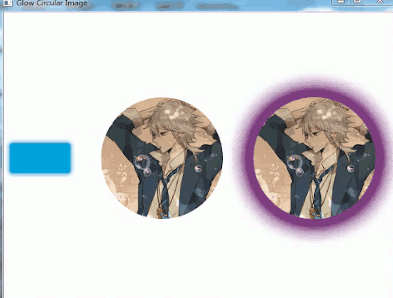
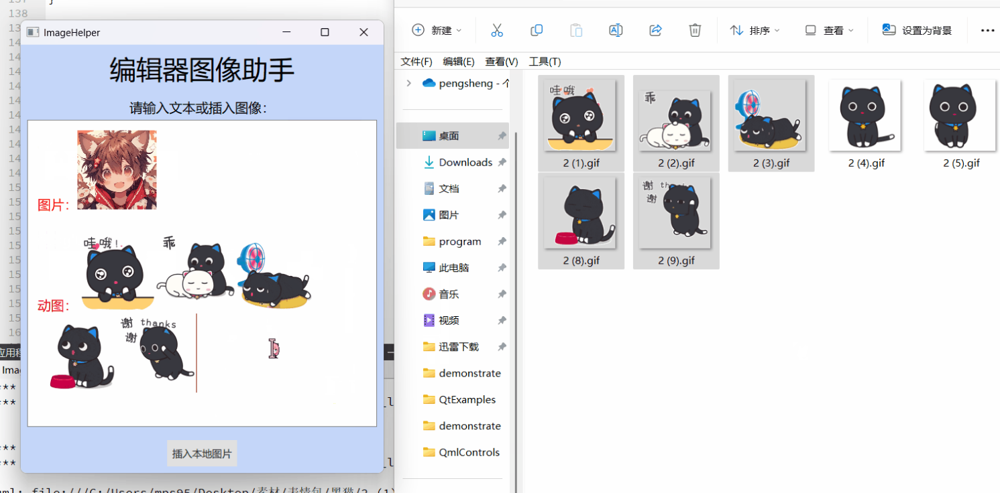
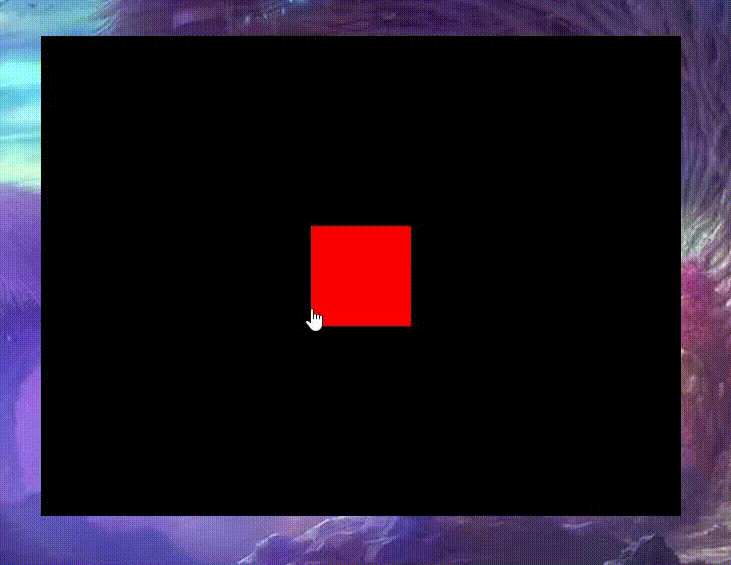
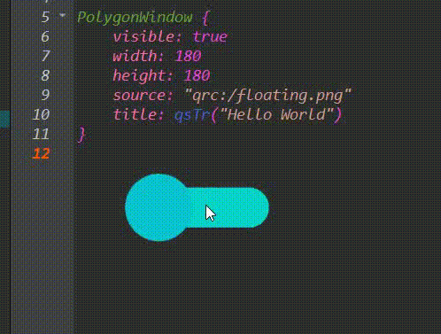
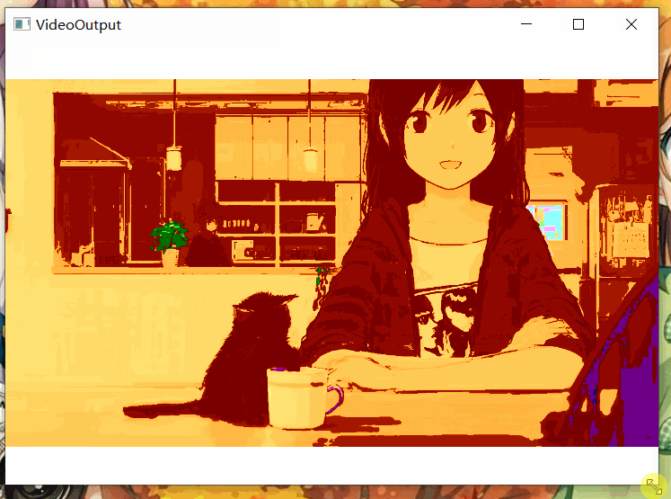
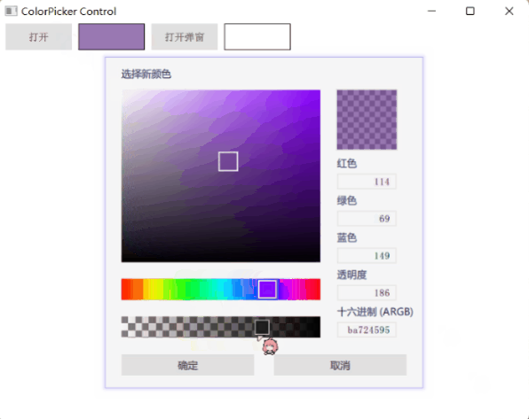
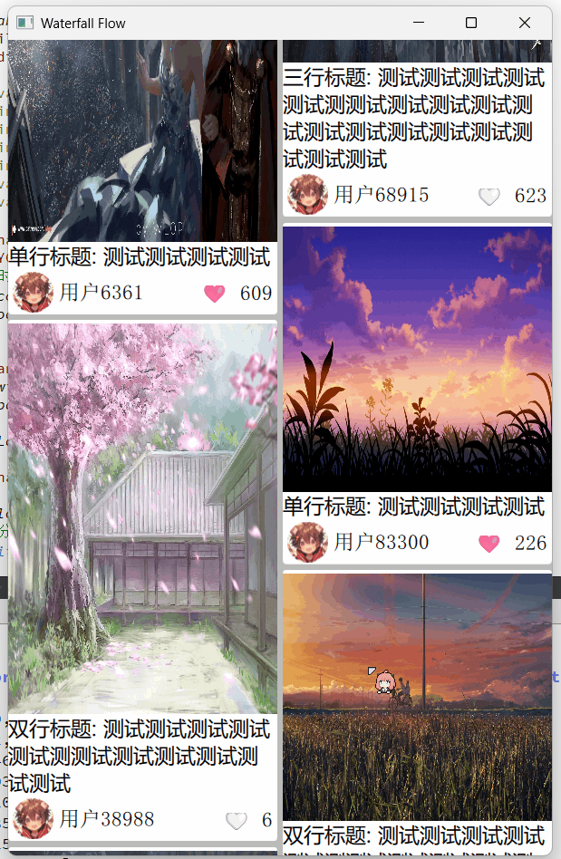
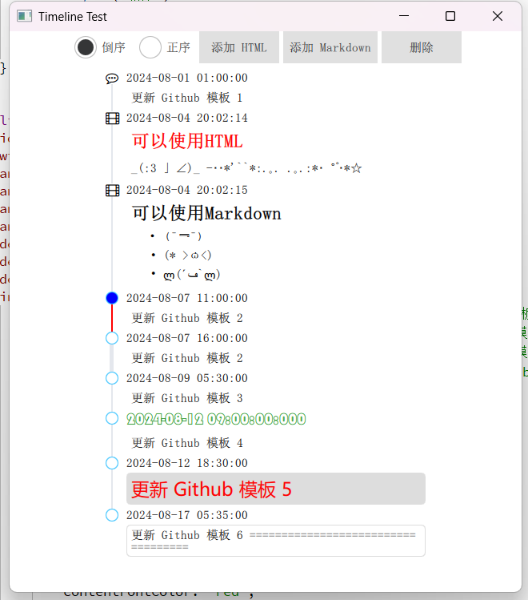
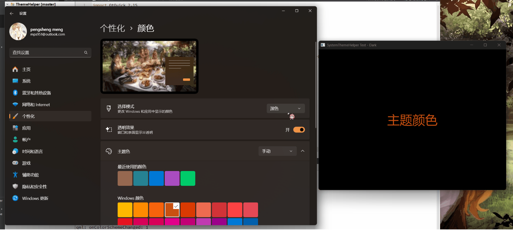
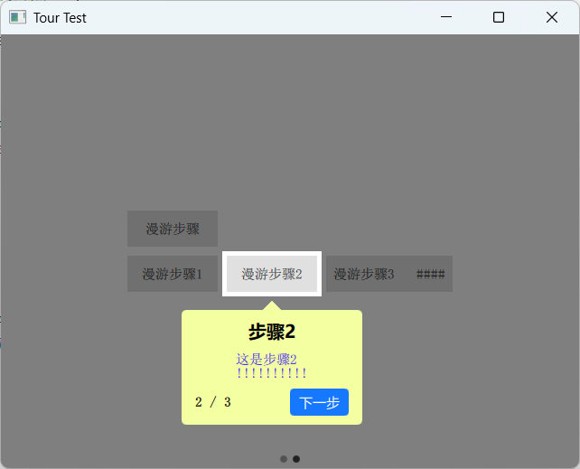

# QmlControls

提供一些有用 Qml 控件 & 实用工具

一些是 `Qt C++实现`, 也有 `纯Qml实现`

------

### 未来路线

将整合本仓库实现较好的组件来实现全新的框架

统一主题 & 风格 & 样式

------

### 如何使用

- 使用 `cmake` 构建

> `CMakeLists.txt` 可构建所有示例
>
> 如需单独构建，直接进入目录构建 `*/CMakeLists.txt` 

- 使用 `qmake` 构建

> `Run.pro` 可构建所有示例
>
> 如需单独构建，直接进入目录构建 `*.pro` 

------

### 所有控件&工具预览

[预览图均为GIF，较大](./demonstrate/demonstrate.md)

------

### 控件&工具列表 (部分动态预览图被替换为静态)

名称 | 说明 | 支持 | 示例 
---------|----------|---------|---------
 GlowCircularImage | 圆形图像/发光图像 | `Qt5` | 

 MagicFish | 灵动的小鱼 | `Qt5` | 

 EditorImageHelper | 编辑器图像助手(支持动图)  |  `Qt5` | 

 FramelessWindow | 无边框窗口 | `Qt5` | 

 
 PolygonWindow | 多边形窗口 | `Qt5` | 

 HistoryEditor | 历史编辑器 ( 支持历史搜索 & 关键字匹配 ) | `Qt5` | 

 VideoOutput | Qml中支持原始视频图像格式(YUV / RGB) | `Qt5` | 

 FpsItem | Qml中显示帧率的组件 | `Qt5` | 

 ColorPicker / ColorPickerPopup | 仿 `Windows10 画图3D` 的颜色选择器, 但更加强大 | `Qt5` | 

 WaterfallFlow | 瀑布流视图(并且可以自适应)，类似小红书 | `Qt5` | 

 AsyncHasher | 可对任意数据(url/text/object)生成加密哈希的异步散列器 | `Qt5` | 

 Notification | 悬浮出现在(全局/局部)页面上的通知提醒消息 | `Qt5` | 

 Timeline | 可视化地呈现时间流信息的组件 |  `Qt5` | 

 MoveMouseArea / ResizeMouseArea | 给任意目标添加[移动/调整大小操作]的鼠标区域 | `Qt5` | 

 WaveProgress | 动态的水波进度条 | `Qt5` | 

 Rate | 对某个事物进行评级 | `Qt5` | 

 SystemThemeHelper | (Qt5/Qt6) 系统主题助手 `[Dark/Light]主题检测 & 感知` | `Qt5` `Qt6` | 

 Watermark | 可给页面的任意项加上水印 | `Qt5` | 

 Tour(TourFocus/TourStep) | 用于分步引导用户了解产品功能的气泡组件。 | `Qt5` | 

------

### 许可证

 使用 `MIT LICENSE`

------

### 开发环境

windows 11，Qt 5.15.2 / Qt 6.7.3

------

### Star 历史

