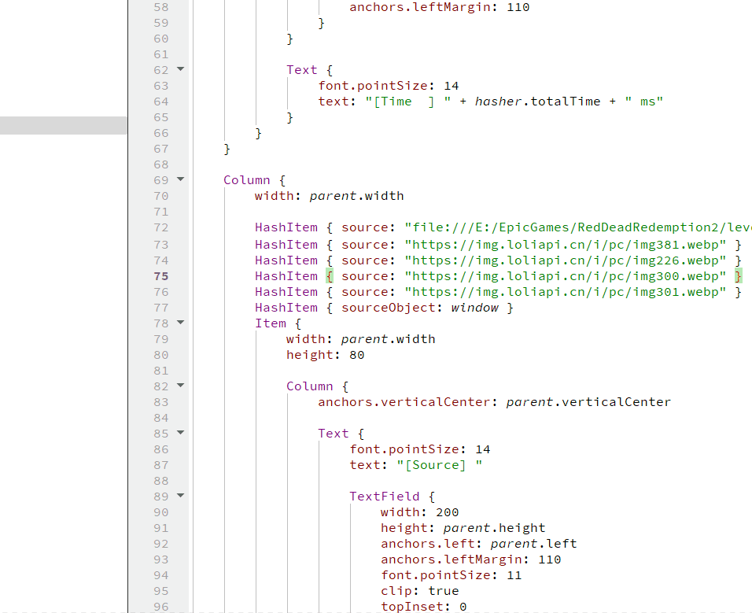
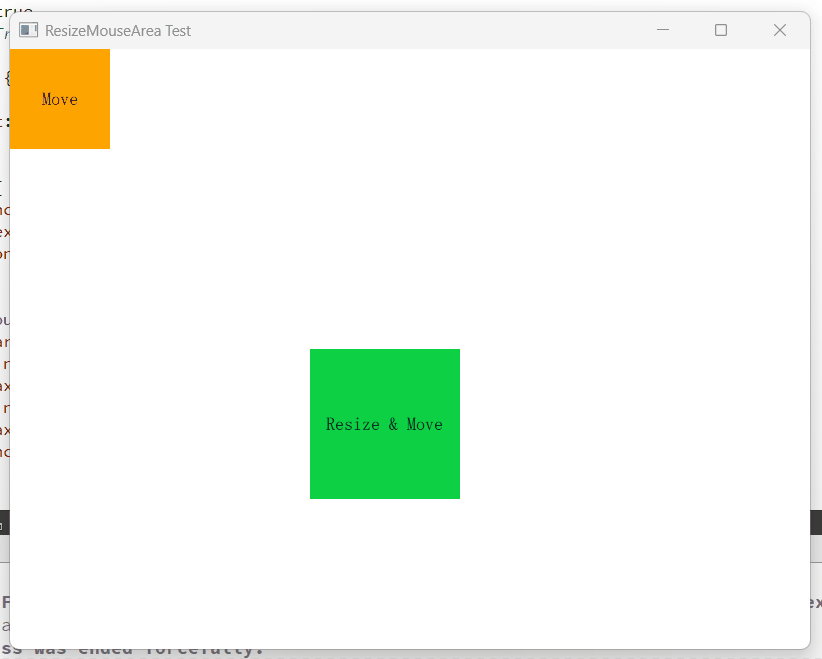
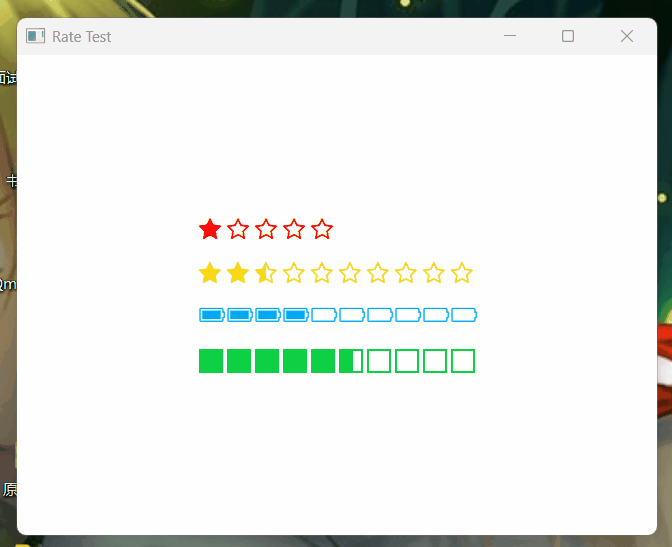
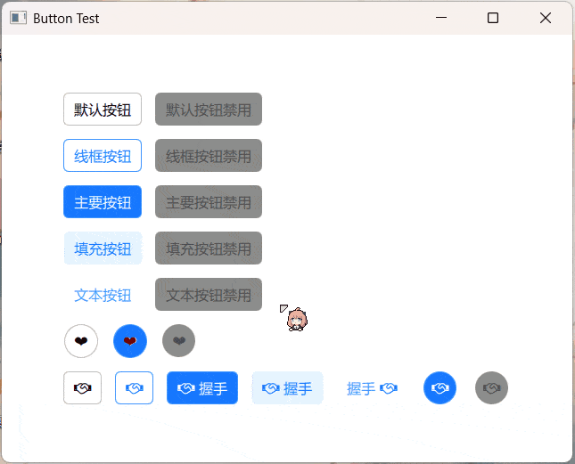
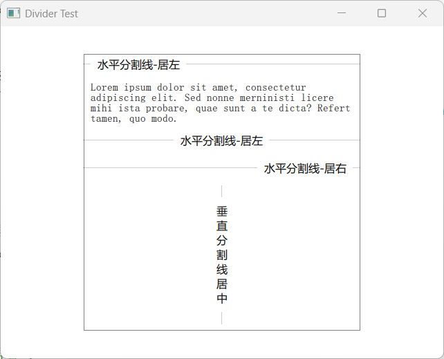
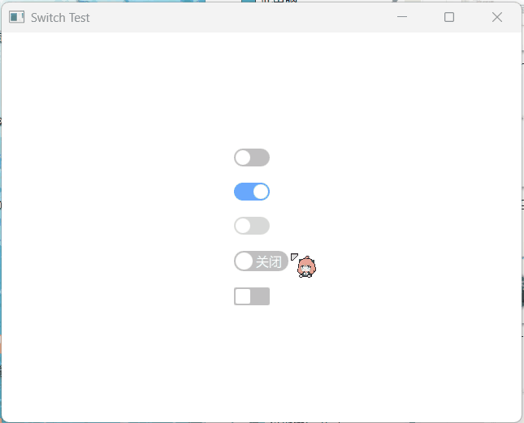
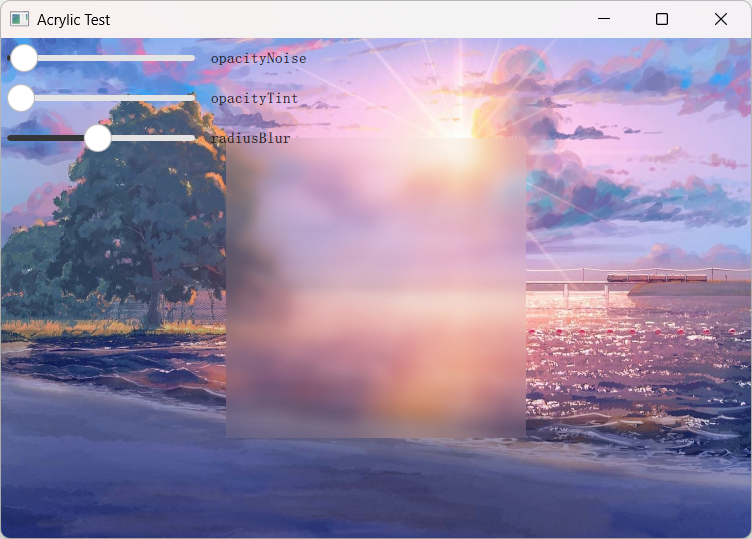

## 控件预览

 - GlowCircularImage 圆形图像/发光图像

 - MagicFish 灵动的小鱼

 - EditorImageHelper 编辑器图像助手(支持动图) 

 - FramelessWindow 无边框窗口

 - PolygonWindow 多边形窗口

 - HistoryEditor 历史编辑器(支持历史搜索 & 关键字匹配)

 - VideoOutput Qml中支持原始视频图像格式(YUV / RGB)

 - FpsItem Qml中显示帧率的组件

 - ColorPicker / ColorPickerPopup 仿 `Windows10 画图3D` 的颜色选择器, 但更加强大

 - WaterfallFlow 瀑布流视图(并且可以自适应)，类似小红书

 

 - AsyncHasher 可对任意数据(url/text/object)生成加密哈希的异步散列器

 

 - Notification 悬浮出现在(全局/局部)页面上的通知提醒消息

 

 
 - Timeline 可视化地呈现时间流信息的组件

 

 - MoveMouseArea / ResizeMouseArea 给任意目标添加[移动/调整大小操作]的鼠标区域

 

 - WaveProgress 动态的水波进度条

 

 
 - Rate 对某个事物进行评级

 

 - SystemThemeHelper (Qt5/Qt6) 系统主题助手 `[Dark/Light]主题检测 & 感知`

 

 - Watermark 给页面的任意项加上水印

 

  - Tour 用于分步引导用户了解产品功能的气泡组件。

 

   - Button 按钮用于开始一个即时操作。

 

   - Divider 用于区隔内容的分割线。

 

   - Switch 使用开关在两种状态之间切换。

 

 
   - Acrylic 亚克力/毛玻璃效果

 

  - RoundRectangle 任意角都可以是圆角的矩形

 

 
   - TabView 通过选项卡标签切换内容的组件。

 

