## 控件预览

 - GlowCircularImage 圆形图像/发光图像

 - MagicFish 灵动的小鱼

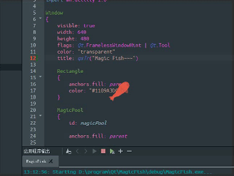

 - EditorImageHelper 编辑器图像助手(支持动图) 

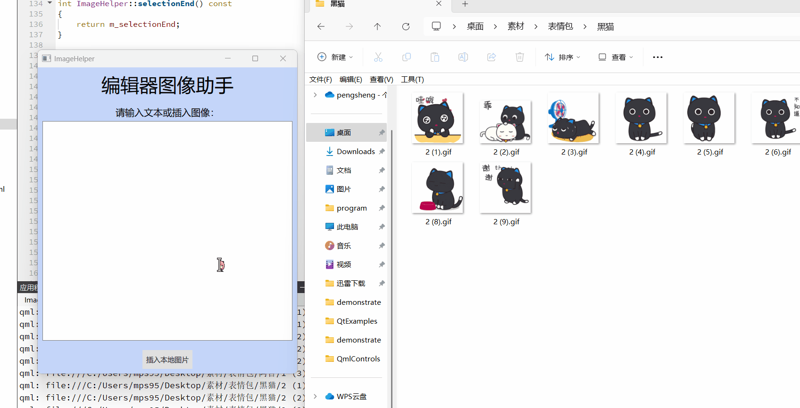

 - FramelessWindow 无边框窗口

 - PolygonWindow 多边形窗口

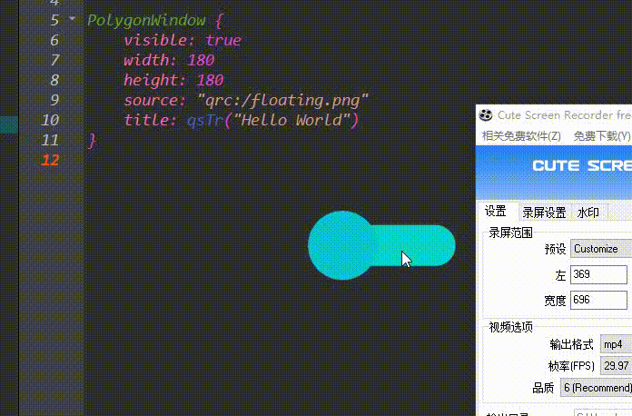

 - HistoryEditor 历史编辑器(支持历史搜索 & 关键字匹配)

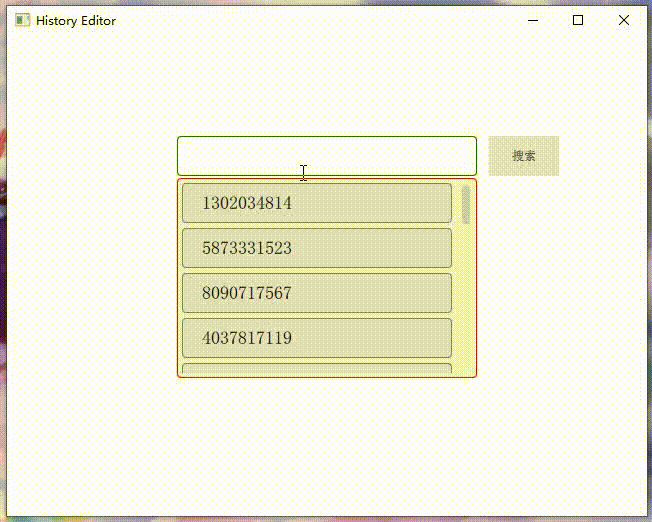

 - VideoOutput Qml中支持原始视频图像格式(YUV / RGB)

 - FpsItem Qml中显示帧率的组件

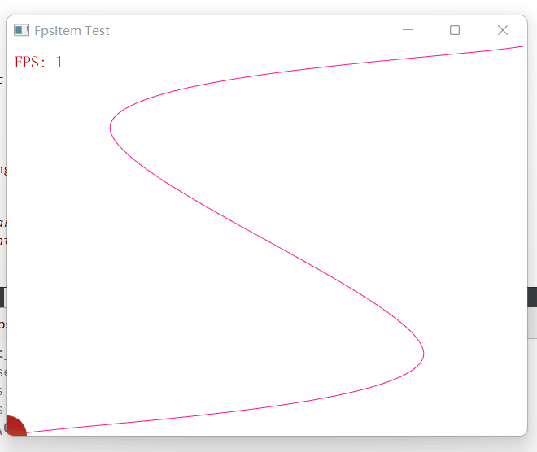

 - ColorPicker / ColorPickerPopup 仿 `Windows10 画图3D` 的颜色选择器, 但更加强大

 - WaterfallFlow 瀑布流视图(并且可以自适应)，类似小红书

 

 - Notification 悬浮出现在(全局/局部)页面上的通知提醒消息

 
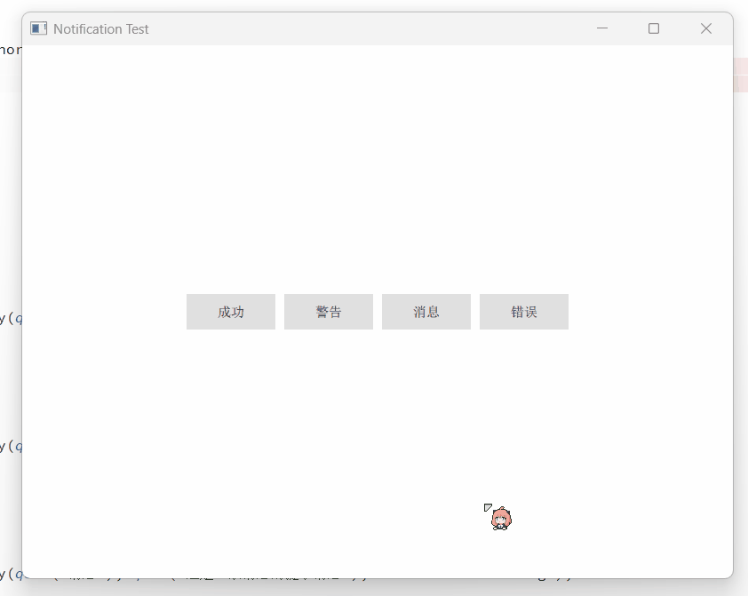

 
 - Timeline 可视化地呈现时间流信息的组件

 

 - WaveProgress 动态的水波进度条

 
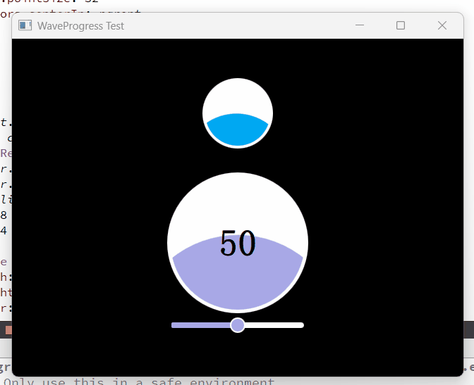

 - DelMoveMouseArea / DelResizeMouseArea 给任意目标添加[移动/调整大小操作]的鼠标区域

 

 - DelAsyncHasher 可对任意数据(url/text/object)生成加密哈希的异步散列器

 

 
 - DelRate 对某个事物进行评级

 
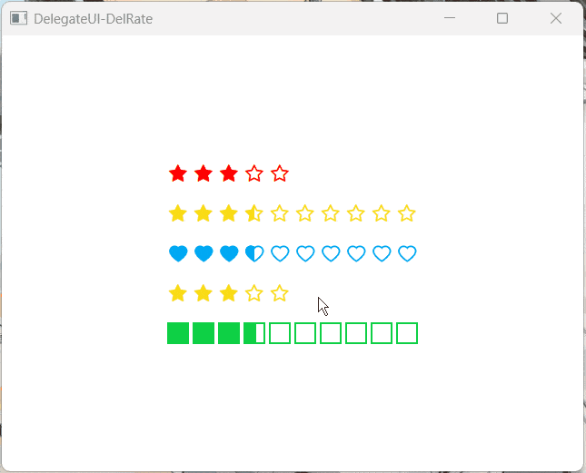

 - DelSystemThemeHelper (Qt5/Qt6) 系统主题助手 `[Dark/Light]主题检测 & 感知`

 
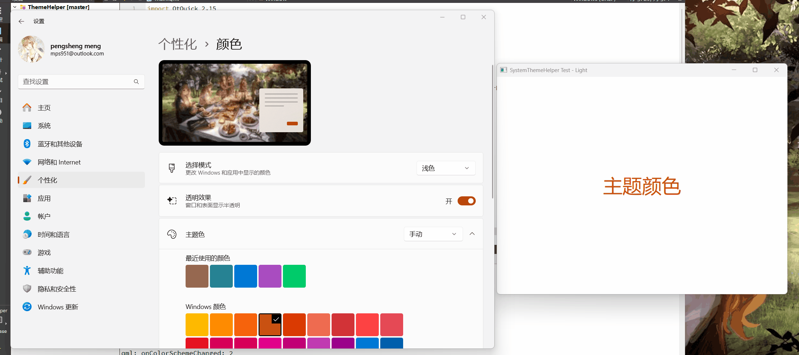

 - DelWatermark 给页面的任意项加上水印

 

  - DelTour 用于分步引导用户了解产品功能的气泡组件。

 
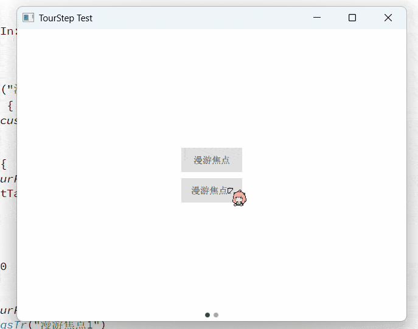

   - DelButton 按钮用于开始一个即时操作。

 
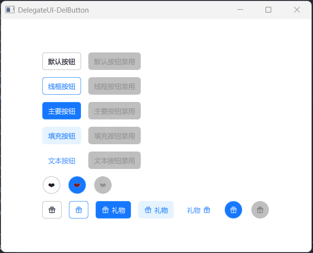

   - DelDivider 用于区隔内容的分割线。

 

   - DelSwitch 使用开关在两种状态之间切换。

 

 
   - DelAcrylic 亚克力/毛玻璃效果

 
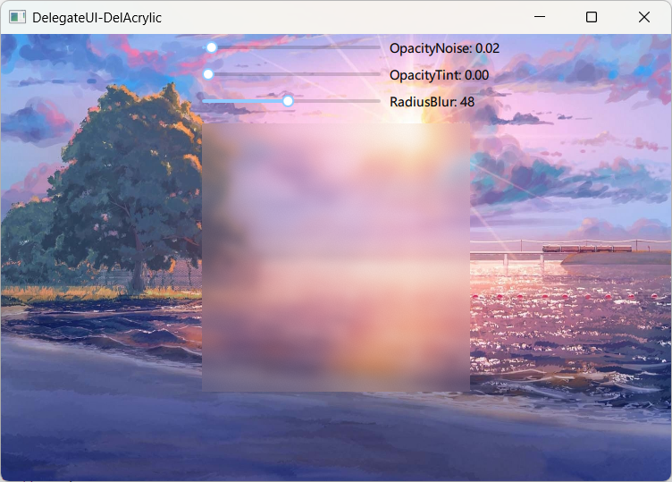

  - DelRoundRectangle 任意角都可以是圆角的矩形

 
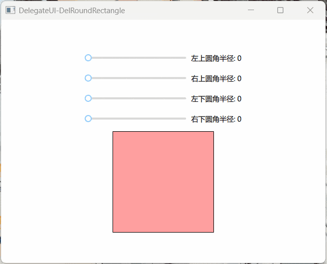

 
   - DelTabView 通过选项卡标签切换内容的组件。

 

   - DelRadio 用于在多个备选项中选中单个状态。

 
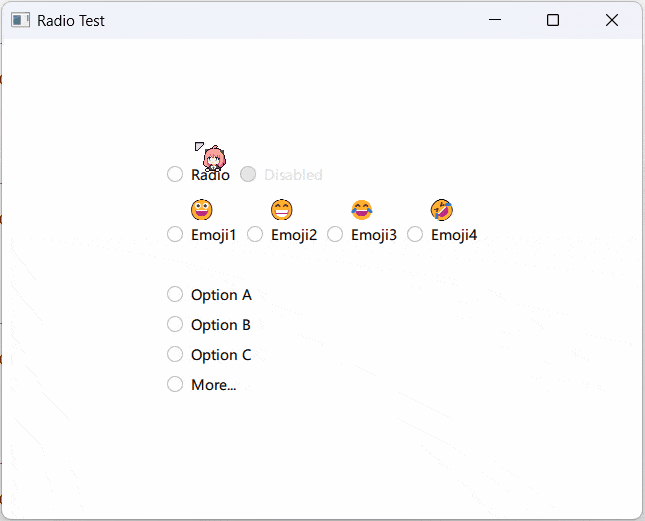

   - DelRadioBlock(DelRadio 变体) 用于在多个备选项中选中单个状态。

 
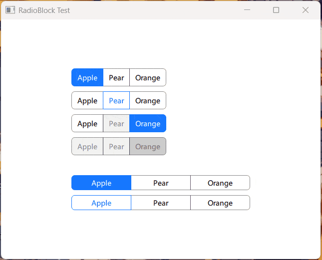

   - DelCheckBox 收集用户的多项选择。

 

   - DelInput 通过鼠标或键盘输入内容，是最基础的表单域的包装(即传统输入框)。

 
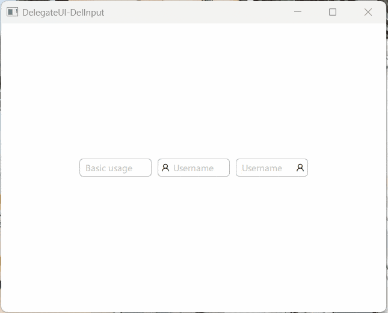

   - DelOTPInput 用于接收和验证一次性口令的输入框组合，通常用于验证码或密码。

 
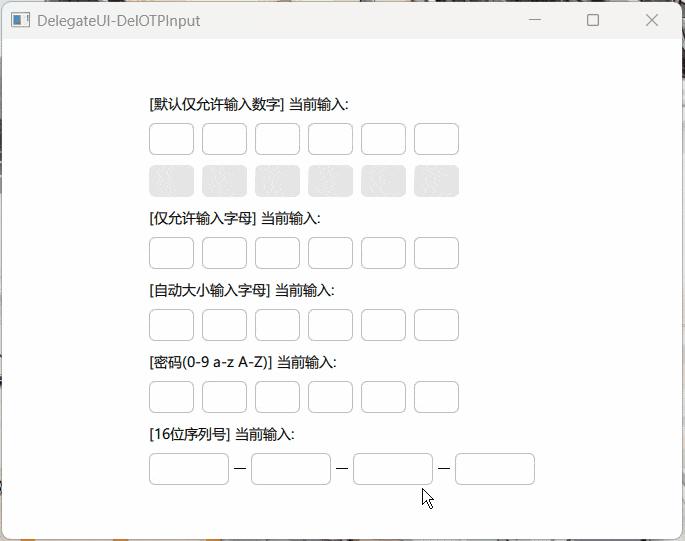

   - DelSlider 滑动型输入器，展示当前值和可选范围。

 
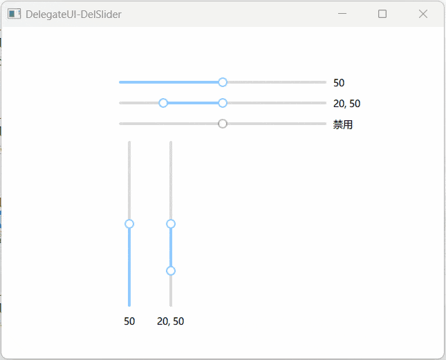

   - DelScrollBar 滚动条是一个交互式栏，用于滚动某个区域或视图到特定位置。

 
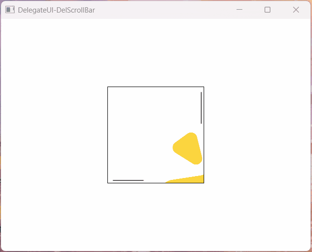

   - DelTimePicker 输入或选择时间的控件。

 

   - DelDrawer 屏幕边缘滑出的浮层面板。

 
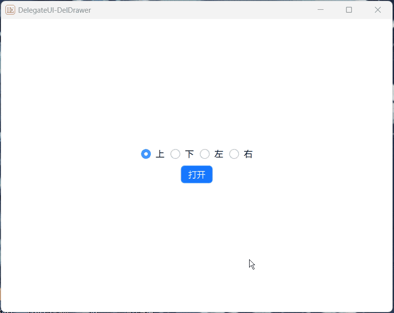

   - DelCollapse 可以折叠/展开的内容区域。

 

   - DelAvatar 用来代表用户或事物，支持图片、图标或字符展示。

 
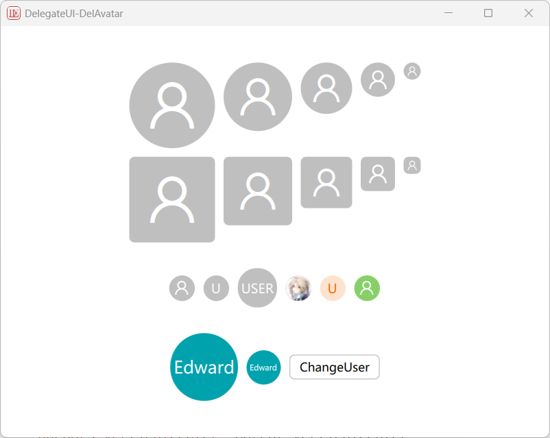

   - DelCard 基础的卡片容器，可承载文字、列表、图片、段落，常用于后台概览页面。

 
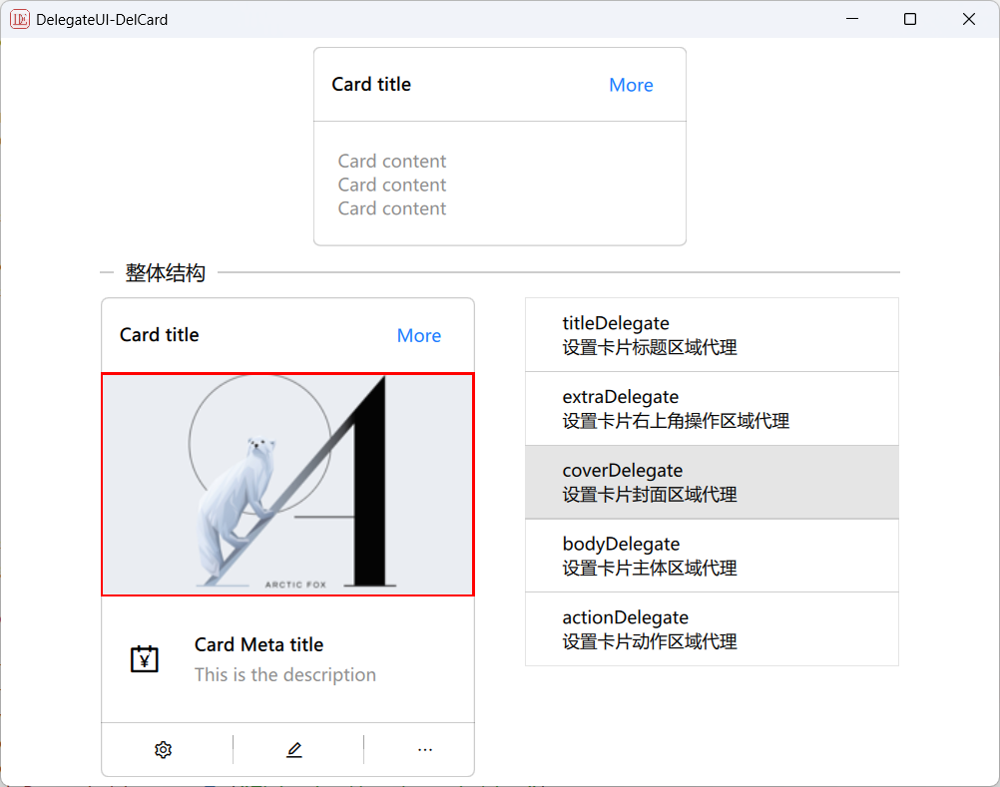

   - DelToolTip 简单的文字提示气泡框(替代基础ToolTip)。

 
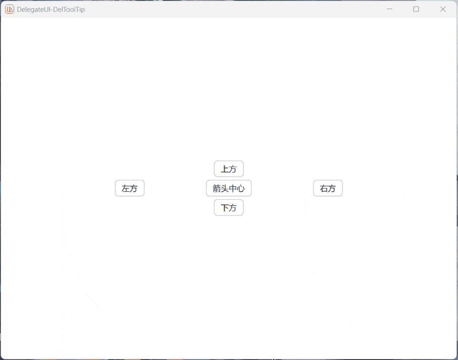

   - DelPopup 自带跟随主题切换的背景和阴影(替代基础Popup)。

 
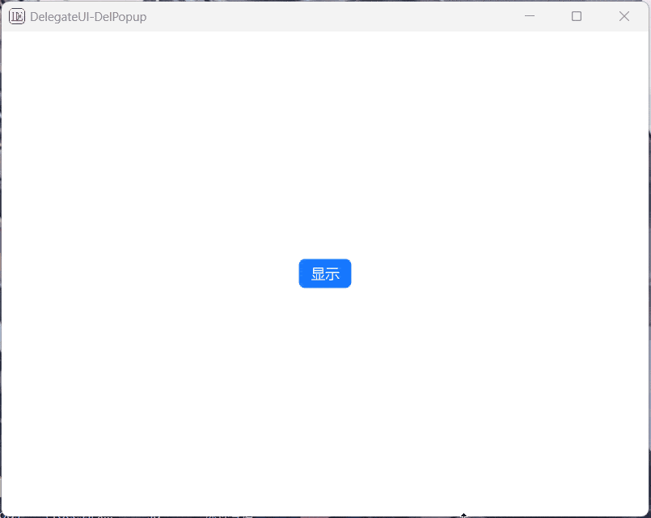

   - DelSelect 下拉选择器(替代基础ComboBox)。

 
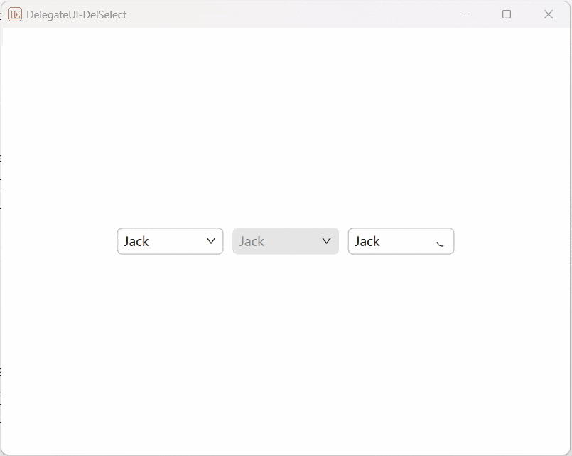

   - DelPagination 分页器，用于分隔长列表，每次只加载一个页面。

 

